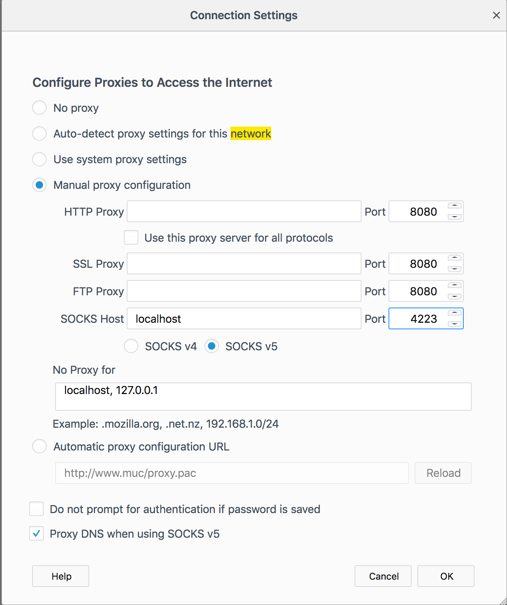
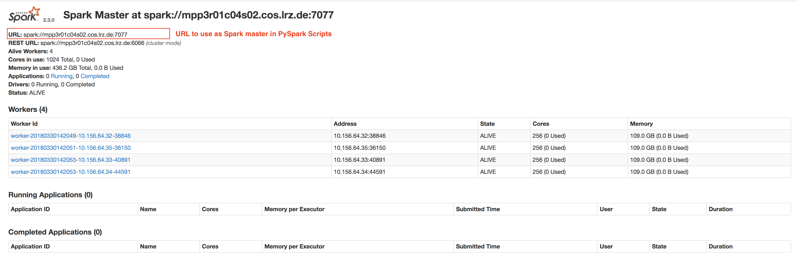

# Exercise-2018

1. Needed modules:
	
		module load git
		module load gcc/7
		module load java/1.8
		export TMPDIR=/tmp/$USER

* Use project directory as home is too small

2. Anaconda:

* Use Project ( `pn69si`) Anaconda Installation

* Path `/home/hpc/pn69si/mnmda001/software/anaconda3` 

		source /home/hpc/pn69si/mnmda001/software/anaconda3/bin/activate root

3. Jupyter Page for Notebooks:

* Recommended way to access Jupyter Notebooks is via SSH portforward:
    
        ssh -fND 4223 lxlogin8.lrz.de
        
    * Set SSH Proxy in your Browser Configuration!
    
    

* Alternatively, the Jupyter Notebooks can be accessed:
    * https://data-analytics.dyndns.lrz.de:1001/lab?
    * https://data-analytics.dyndns.lrz.de:1002/lab?
    * Note: We use a self signed certificate for this page. Please, verify fingerprint and allow browser exception!

    

    

4. Spark

* Spark Web UI: <http://data-analytics.dyndns.lrz.de:8181/>
    

* The nodes and hostnames assigned to the Spark Cluster can change. Please use Web UI to get current MASTER URL for your job submission! 

5. Howto Slurm:

* Show clusters

         sacctmgr list clusters

* Show Info for 1 Cluster

        sinfo --clusters=mpp3

* Show Info for default cluster
            
            sinfo
